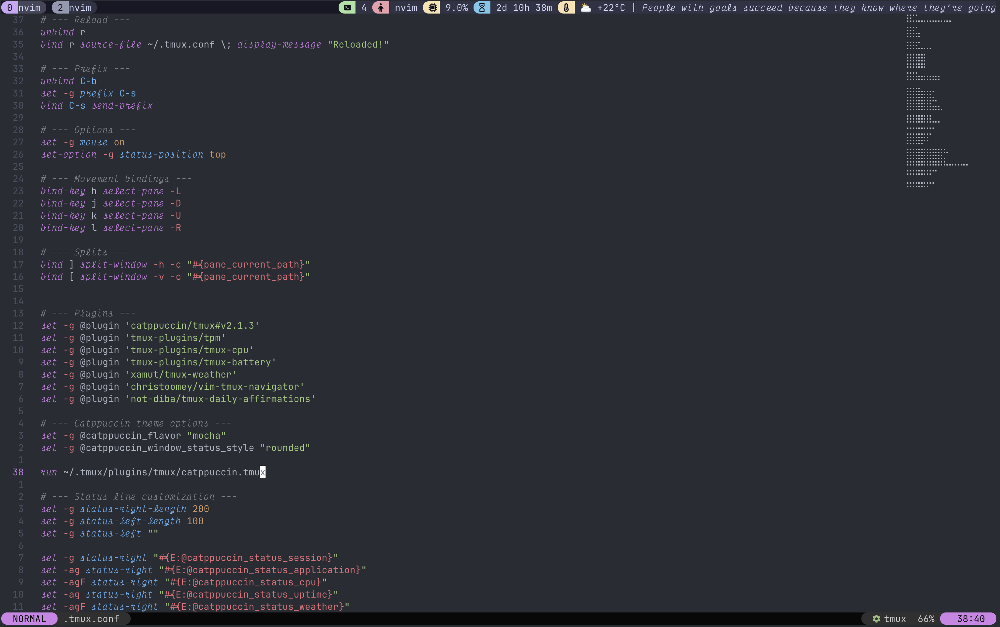

# Tmux Daily Affirmation

Tmux Daily Affirmation is a simple script that displays a daily affirmation message in your tmux status bar. The affirmations are fetched from the [Affirmations API](https://www.affirmations.dev/), providing you with a fresh motivational message every day to keep your workflow uplifting.

## Features

- Fetches a new affirmation once per day (caching to reduce API calls).
- Displays the affirmation in your tmux status bar.
- Lightweight and easy to install via TPM (Tmux Plugin Manager).

## Dependences

 - [jq](https://jqlang.org/) (optional)

## Installation

This plugin requires [Tmux Plugin Manager (TPM)](https://github.com/tmux-plugins/tpm). If you don't have TPM installed, please follow the instructions on its repository.

1. Add the plugin to your `.tmux.conf`:

   ```tmux
   set -g @plugin 'not-diba/tmux-daily-affirmations'

   #Load daily affirmations plugin
   run ~/.tmux/plugins/tmux-daily-affirmations/tmux_daily_affirmations.tmux
   ```

2. Reload tmux configuration or restart tmux:

   ```bash
   tmux source-file ~/.tmux.conf
   ```

3. Install the plugin via TPM by pressing `prefix + I` (capital I) inside tmux.

## Configuration

To display the daily affirmation in your status bar, add the following line to your `.tmux.conf`:

```tmux
set -agF status-right '#{@tmux_daily_affirmation}'
```

### Formatting Example

You can customize the appearance of the affirmation with colors and styles. For example, to display the affirmation in a specific color and italics, add:

```tmux
set -agF status-right ' #[fg=#cdd6f4]| #[fg=#cdd6f4,italics]#{@tmux_daily_affirmation}'
```

This will prepend a separator `|` in the specified color, followed by the affirmation in the same color and italics.

## Example



## Notes

- **Caching:** The affirmation is fetched once per day to minimize API requests and ensure consistent messaging throughout the day.
- **Status Bar Overflow:** Depending on the length of the affirmation and your tmux status bar width, the message might sometimes overflow or get truncated. You can adjust your status bar length or font size to accommodate longer affirmations.

## Contributing & License

Contributions and suggestions are welcome! Please feel free to open issues or submit pull requests.

This project is open source and available under the MIT License.

